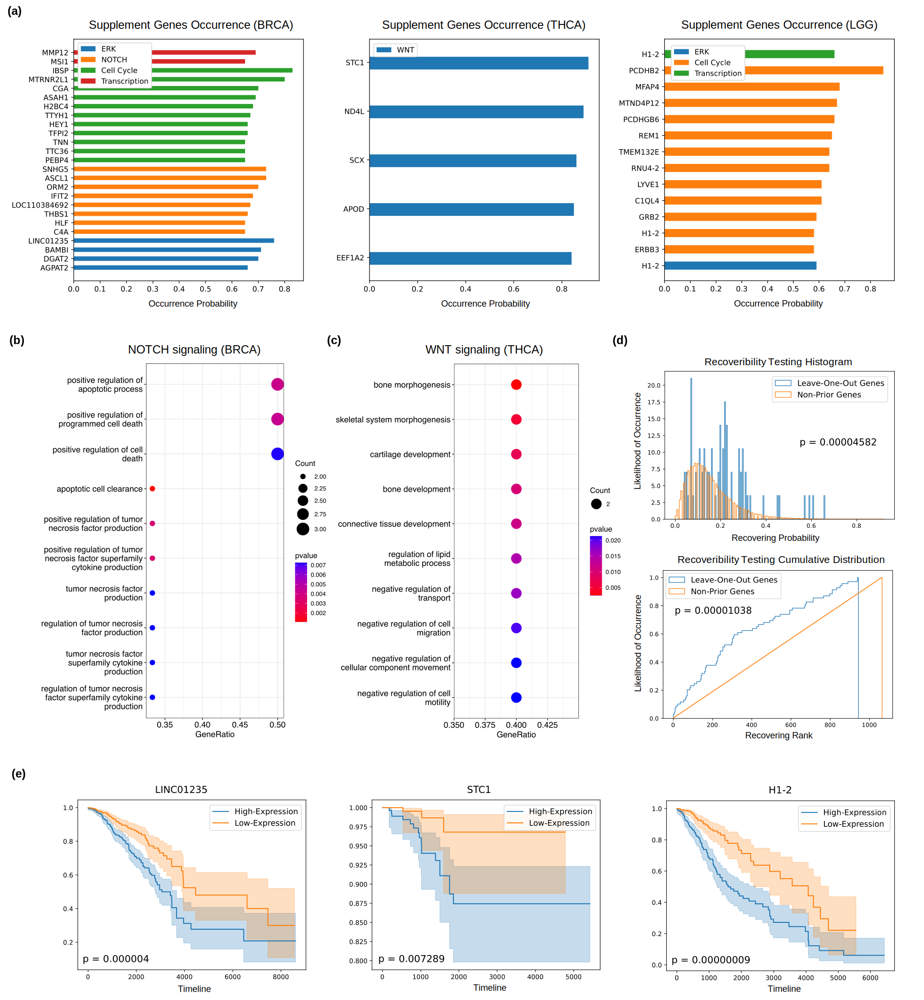

# PathExpSurv: Pathway Expansion for Explainable Survival Analysis and Cancer Driver Gene Discovery


## Requirements
* torch
* numpy
* pandas


## Data Preparation

We obtain 3 different survival datasets from [UCSC Xena](https://xenabrowser.net/datapages/): (1) Thyroid Cancer (THCA) Dataset, (2) Lower Grade Glioma (LGG) Dataset, (3) Breast Cancer (BRCA) Dataset. We took the prior pathways as the functional modules. The source of the prior signaling pathways is：[KEGG DISEASE Database](https://www.kegg.jp/kegg/disease/). We put them  into the `Dataset/` folder.


## Model Training
```bash
# Two-Phase Training
python main.py --task='LGG'
```


## Results

### Performance of Survival Analysis


### Disease Drivers Discovery



